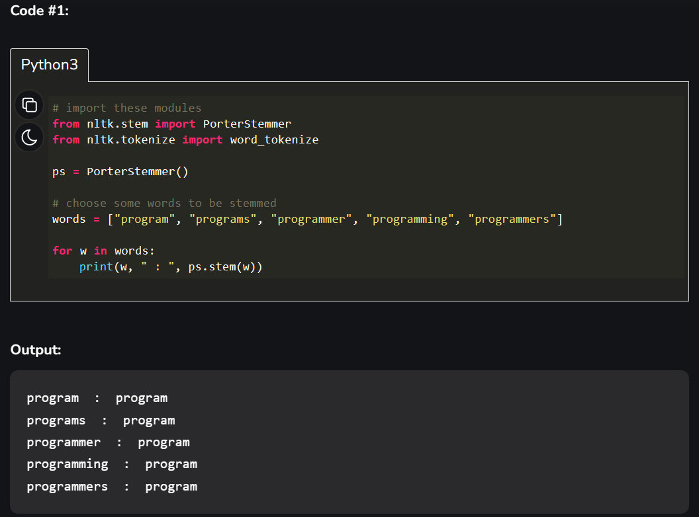
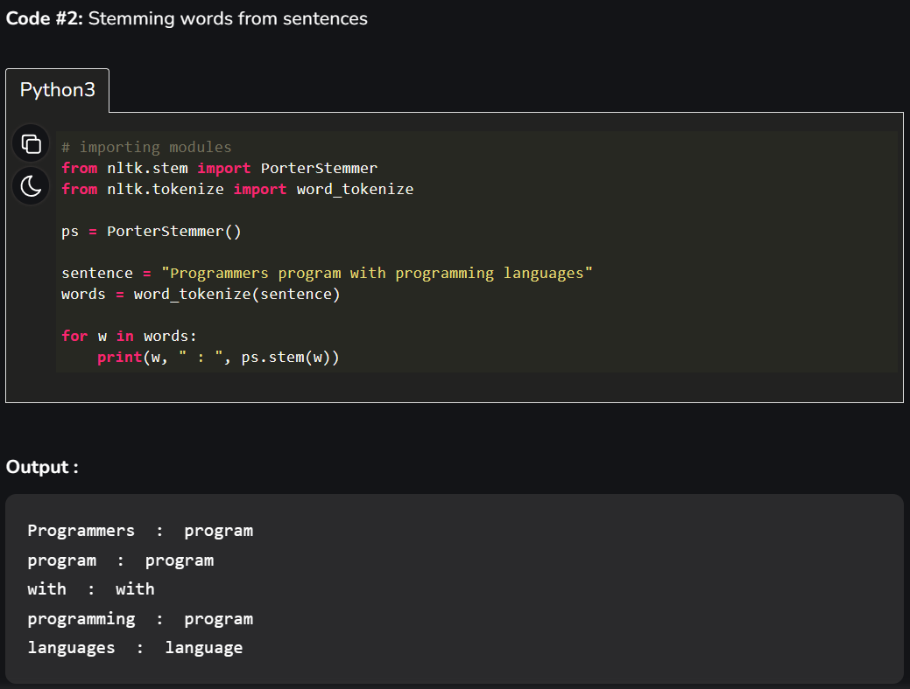
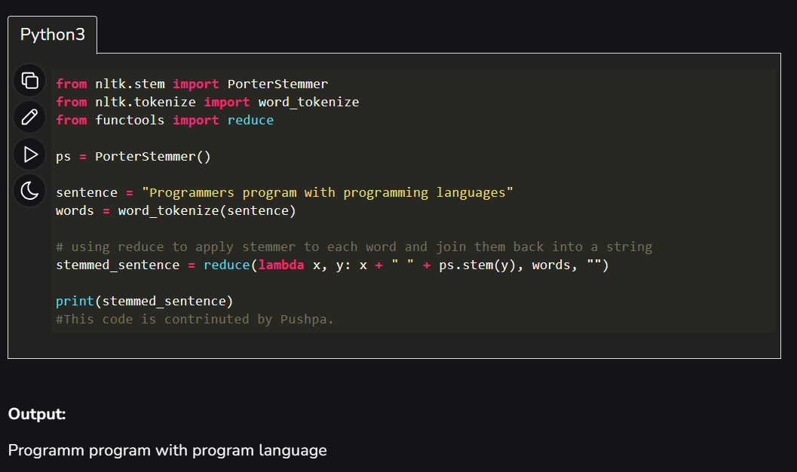

## Stemming words with NLTK (Natural Languages with Toolkit)

**Stemming** is the process of producing morphological variants of a root/base word. Stemming programs are commonly referred to as stemming algorithms or stemmers. A stemming algorithm reduces the words “chocolates”, “chocolatey”, and “choco” to the root word, “chocolate” and “retrieval”, “retrieved”, “retrieves” reduce to the stem “retrieve”.

* __Example__:
Some more example of stemming for root word "like" include:

-> "likes"
-> "liked"
-> "likely"
-> "liking"

**Errors** in Stemming: There are mainly two errors in stemming – Overstemming and Understemming. Overstemming occurs when two words are stemmed from the same root that are of different stems. Under-stemming occurs when two words are stemmed from the same root that is not of different stems.

**Applications of stemming are:** 

+ Stemming is used in information retrieval systems like search engines.
+ It is used to determine domain vocabularies in domain analysis.

### Code for example:

### Code 3: Using reduce()
#### Algorithm:

1. Import the necessary modules: PorterStemmer and word_tokenize from nltk, and reduce from functools.
2. Create an instance of the PorterStemmer class.
3. Define a sample sentence to be stemmed.
4. Tokenize the sentence into individual words using word_tokenize.
5. Use reduce to apply the PorterStemmer to each word in the tokenized sentence, and join the stemmed words back into a string.
6. Print the stemmed sentence.

